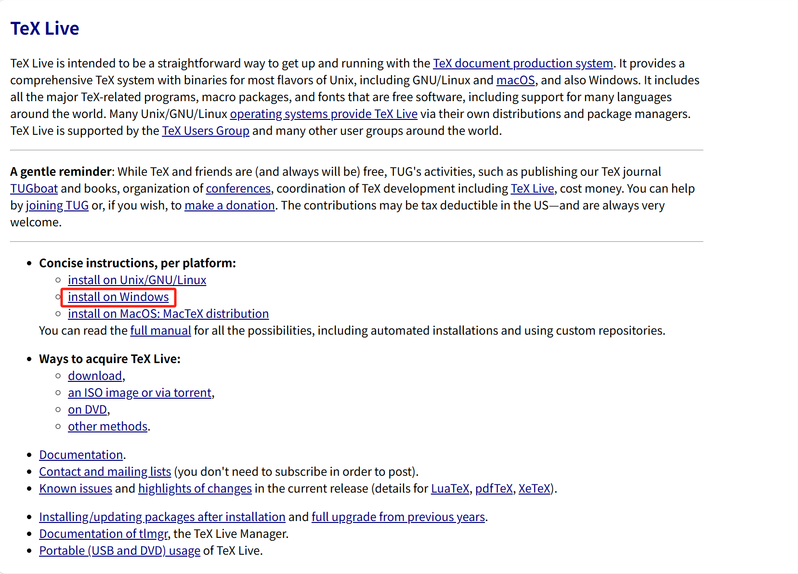
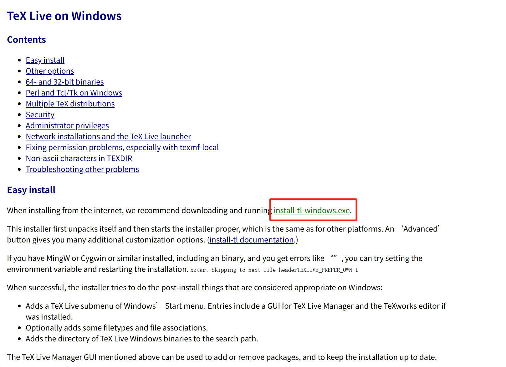

# Resume
## 一、制作
### 1. 流程
#### （1）本地配置 TeX Live（编译引擎，将 .tex 文件转换为 PDF）

windows建议配置wsl或者用mikTeX，可以加快编译速度

下载地址： https://tug.org/texlive/

   

   


#### （2）VS Code 

##### Ⅰ. 安装以下插件：

   LaTeX Workshop — 核心插件

   LaTeX Utilities — 额外辅助（可选）

##### Ⅱ. 添加配置：
打开设置（Ctrl+Shift+P → Preference: Open User Settings (JSON)）
```
{
    "latex-workshop.latex.autoBuild.run": "onSave",
    "latex-workshop.view.pdf.viewer": "tab",
    "latex-workshop.latex.tools": [
        {
            "name": "xelatex",
            "command": "xelatex",
            "args": [
                "-synctex=1",
                "-interaction=nonstopmode",
                "-file-line-error",
                "%DOC%"
            ]
        }
    ],
    "latex-workshop.latex.recipes": [
        {
            "name": "xelatex",
            "tools": ["xelatex"]
        }
    ]
}
```

#### （3）LaTeX 简历模板：GitHub上clone一个模板

推荐两个： 

https://github.com/geekcompany/ResumeSample

https://github.com/posquit0/Awesome-CV

#### （4）GitHub 托管简历迭代更新

#### （5）GitHub Pages 搭建个人展示网站

### 2. 让你的简历更好看

符号：https://www.lddgo.net/common/symbol


## 二、简历模板

提供本人使用模板，见：

牛客知页简历：https://www.zhiyeapp.com/jlmb?label_id=LEqpDm


## 三、个人简历
